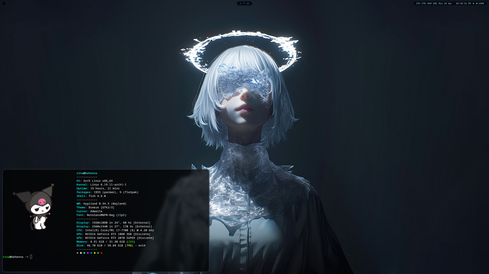

<div align="center">

<br>

```
✦ 110110001 ✦
```

# gehenna

*a rotten vessel. a dark machine. a deliberate thing.*



</div>

---

## components

| layer | tool |
|---|---|
| compositor | [Hyprland](https://hyprland.org) |
| bar | [Waybar](https://github.com/Alexays/Waybar) |
| terminal | [Kitty](https://sw.kovidgoyal.net/kitty/) |
| shell | [fish](https://fishshell.com) |
| fetch | [fastfetch](https://github.com/fastfetch-cli/fastfetch) |
| wallpaper | [swww](https://github.com/LGFae/swww) |

## palette

```
background  #04080c
accent      #7eb8d4
text        #c8d0d9
muted       #3a6080
border      rgba(126, 184, 212, 0.22)
```

## fonts

- **Space Mono** — UI, waybar, terminal
- **NotoSansMNFM Nerd Font** — icons, fastfetch

## install

```fish
git clone https://github.com/sabesena/gehenna.git ~/.config
cd ~/.config
fish install.fish
```

> [!WARNING]
> cloning into `~/.config` directly will overwrite existing configs. back up first, or clone elsewhere and run the script from there.

the install script symlinks all configs into place. safe to re-run — existing files are backed up before being replaced.

## notes

- built for **Arch Linux** on **Hyprland / Wayland**
- dual monitor setup: Dell 1080p (left) + Acer 1440p 170hz (center)
- NVIDIA RTX 2070 Super — `__NV_DISABLE_EXPLICIT_SYNC=1` is set
- colors driven by [matugen](https://github.com/InioX/matugen) on wallpaper change

---

<div align="center">

```
✦ the vessel can act on your machine ✦
```

</div>
